\---  
title: Vellum工作台 · 软件操作手册  
app_name: Vellum工作台  
app_version: v1.8.1（含第 21~22 批功能集）  
doc_version: 1.0  
updated: 2026-10-04  
audience: 全新电脑、未装任何软件、对电脑操作不熟练的使用者  
platform: Windows 10 / 11（64 位）  
\---

# Vellum工作台 · 软件操作手册

> **这份手册写给谁**：给你一台**刚拆封、什么都没装**的 Windows 电脑，你也没怎么用过复杂软件。  
> 从头看完第 1、2 部分就能开始干活；第 3 部分是"每个按钮是干什么的"；第 4、5 部分是"红线在哪"。
>
> **阅读约定**
>
> | 记号         | 含义                               |
> | ---------- | -------------------------------- |
> | 🟦 **必须做** | 不做就没法往下走                         |
> | 🟨 **注意**  | 容易踩坑的地方                          |
> | 🟥 **危险**  | 可能造成数据丢失，必须停下来读                  |
> | 📷 `图`     | 软件截图（截图里的工作区路径是演示环境，你看到的是你自己的路径） |

---

## 目录

- [第 1 部分　装好它：从一台新电脑开始](#第-1-部分装好它从一台新电脑开始)
  - [1.1 你需要准备什么](#11-你需要准备什么)
  - [1.2 安装步骤（照着点）](#12-安装步骤照着点)
  - [1.3 第一次打开，软件自动做了什么](#13-第一次打开软件自动做了什么)
  - [1.4 第一次配置：8 步上手](#14-第一次配置8-步上手)
  - [1.5 备份 / 换电脑 / 卸载](#15-备份--换电脑--卸载)
- [第 2 部分　理解它：工单、任务、素材是什么关系](#第-2-部分理解它工单任务素材是什么关系)
  - [2.1 一句话讲清](#21-一句话讲清)
  - [2.2 四层结构图](#22-四层结构图)
  - [2.3 三者对照表](#23-三者对照表)
  - [2.4 三条"铁律"（理解了这三条，就不会踩坑）](#24-三条铁律理解了这三条就不会踩坑)
  - [2.5 典型一天的用法](#25-典型一天的用法)
- [第 3 部分　用它：界面逐块讲](#第-3-部分用它界面逐块讲)
  - [3.1 界面总览](#31-界面总览)
  - [3.2 顶栏](#32-顶栏)
  - [3.3 左栏](#33-左栏)
  - [3.4 任务视图](#34-任务视图)
  - [3.5 任务详情弹窗](#35-任务详情弹窗)
  - [3.6 文件视图](#36-文件视图)
  - [3.7 工单队列](#37-工单队列顶栏第一格)
  - [3.8 全部弹窗与按钮速查表](#38-全部弹窗与按钮速查表)
- [第 4 部分　边界：限制、前置条件、做不到的事](#第-4-部分边界限制前置条件做不到的事)
  - [4.1 环境与硬件要求](#41-环境与硬件要求)
  - [4.2 功能限制清单](#42-功能限制清单)
  - [4.3 工单同步的前置条件与三类失败](#43-工单同步的前置条件与三类失败)
- [第 5 部分　合法但不推荐：12 个"能干但别干"的动作](#第-5-部分合法但不推荐12-个能干但别干的动作)
- [第 6 部分　常见问题 FAQ](#第-6-部分常见问题-faq)
- [第 7 部分　附录](#第-7-部分附录)

---

# 第 1 部分：装好它，从一台新电脑开始

## 1.1 你需要准备什么

### 必须的（缺一不可）

| 项目      | 要求                                 | 说明                         |
| ------- | ---------------------------------- | -------------------------- |
| 电脑系统    | **Windows 10 或 Windows 11，64 位**   | 目前只有 Windows 安装包，没有 Mac 版  |
| 安装包     | `VellumDesk-x.x.x-Setup.exe`（约 180 MB） | 找管理员/同事要，微信、企业微信传文件都行      |
| 磁盘空间    | 建议 **≥ 20 GB 空闲**                  | 软件本身约 1 GB；真正吃空间的是你导入的设计文件 |
| 存放素材的硬盘 | 建议**单独一个盘符**（如 `D:`）或一块移动硬盘        | 素材默认放 `D:\vellum_workspace`，和系统盘分开更安全 |

### 不需要额外装的（软件自带）

很多人第一次会问"要不要装 Python / FFmpeg / 图片查看器"——**都不用**。下面这些已经打包在安装包里：

| 能力           | 谁提供的        | 你要做什么 |
| ------------ | ----------- | ----- |
| 图片缩略图        | sharp（已内置）  | 无     |
| 视频缩略图与时长     | FFmpeg（已随包） | 无     |
| PSD / PSB 预览 | 内置解析        | 无     |
| PDF 首页缩略图    | pdfjs（已内置）  | 无     |
| 数据库          | SQLite（已内置） | 无     |
| 工单同步 / 指派 / 导出报表 | 企微组件 wecom-cli（已随安装包） | 无 —— 只需扫码授权一次（见 1.4 第 6~8 步） |

### 可选、按需（不影响主功能）

| 能力                   | 需要什么                                         | 不装的后果                            |
| -------------------- | -------------------------------------------- | -------------------------------- |
| **工单同步 / 指派 / 导出报表** | **不用装任何东西**（企微组件 wecom-cli 已随软件内置）；只需用手机企业微信**扫码授权一次**，再把两张表的链接配好 | 没授权就同步不了，界面会直接弹出授权引导；**其余全部功能正常**。完整步骤见 1.4 第 6~8 步 |
| 打开 PSD / AI 等源文件     | 电脑上装 Photoshop / Illustrator 等               | 软件能预览缩略图，但双击打开会找不到程序             |

---

## 1.2 安装步骤（照着点）

1. **把安装包存到电脑上**（比如桌面），双击运行。
2. 🟨 **会弹出蓝色的"Windows 已保护你的电脑"**——这是正常现象，因为安装包**没有购买代码签名证书**（企业内部软件常见）。  
   点 **「更多信息」→「仍要运行」**，不要点「不运行」。
   > 为什么没签名：代码签名证书需要每年付费购买。软件完全在公司内网使用，走内部渠道分发即可。
3. **选择安装位置**。安装向导会让你选目录（第 15 批起支持自选）：
   - 默认是 `C:\Program Files\Vellum工作台` 之类的系统目录；
   - 🟨 建议改成 **非系统盘**，例如 `D:\软件\Vellum工作台`；
   - 这个目录只放**软件本身**，和你的素材工作区（第 1.3 节）是两回事。
4. 一路「下一步」→「安装」→ 等待进度条走完 → **「完成」**（可以勾选直接启动）。
5. 安装完成后：
   - 开始菜单会出现 **「Vellum工作台」**；
   - 桌面上也可能有快捷方式，双击即可打开；
   - 卸载走"控制面板 → 程序和功能 → Vellum工作台"。

---

## 1.3 第一次打开，软件自动做了什么

双击图标，第一次启动大约 3~10 秒（之后会快很多）。软件会**自动**完成下面这些事，你不需要干预：

| 自动动作        | 结果                                                  | 你可以怎么看                    |
| ----------- | --------------------------------------------------- | ------------------------- |
| 选择素材工作区位置   | 首选 `D:\vellum_workspace`；**如果电脑没有 D 盘**，自动落到 `文档\vellum_workspace`        | 左栏最下方「工作区」区块，状态栏最右侧显示完整路径 |
| 建好工作区骨架     | 建 `_thumbs`（缩略图）、`_system`（软件自带数据）、`_回收站`、`_已解绑的项目` | 打开文件夹就能看到                 |
| 建数据库        | `工作区\_system\media.db`                              | 不用管它，别删（见第 5 部分）          |
| 预置 6 个项目    | 海南升学集训营 / 精英升学先修营 / 精英志愿填报中心 / 一对一项目部 / 精英岛 / 总部    | 左栏「项目」区块                  |
| 预置两套标签      | **物料类别** 11 项、**使用场景** 7 项                          | 左栏「筛选标签」区块                |
| 关闭 GPU 硬件加速 | 保证各种办公机、老显卡都能稳定打开                                   | 无需关心，这是稳定性设计              |
| 检查企业微信连接   | 还没授权过企业微信，就**自动弹一次扫码引导**（来源：软件自带的企微组件）              | 见第 1.4 节第 6 步                |

> 🟨 **第一次打开，你看到的是「工单队列」**（顶栏第一格，第 22 批起为启动默认）—— 日常第一件事就是看单，所以它既排最前、也是开机第一眼。上面说的项目 / 标签 / 工作区都在**左栏**，点顶栏第二格 **「任务视图」** 就出来了（详见 3.2 / 3.7）。
>
> 🟨 **如果这台电脑还没授权过企业微信，首次启动会顺手弹一次扫码引导**（见 1.4 第 6 步）。
> 点「稍后再说」就行，**不影响任何其它功能**——素材、任务、打包这些完全离线可用。

### 你的工作区长什么样

打开 `D:\vellum_workspace`（左栏「打开文件夹」按钮或资源管理器），你会看到这样的结构：

```
D:\vellum_workspace\                     ← 工作区根（一个文件夹带走全部素材）
├── 海南升学集训营\                ← 项目文件夹（= 左栏项目）
│   └── 海南招生海报-2026秋季\      ← 任务文件夹（= 界面上的任务卡片）
│       └── V1\                    ← 第 1 稿（新建任务时自动建好）
│           ├── 01-成品\           ← 最终交付文件放这里
│           ├── 02-素材\           ← 用到的图片/字体等原始素材
│           └── 03-工程\           ← PSD / AI 等源文件
├── 精英升学先修营\
├── _thumbs\                       ← 软件生成的缩略图（别手动改）
├── _system\                       ← 数据库与备份（🟥 别删）
├── _回收站\                       ← 删进回收站的整个项目
└── _已解绑的项目\                  ← 结项留底的项目
```

> **一张铁律**：**你在软件里看到什么，资源管理器里就是什么；反过来也一样。** 所有素材都在你本机硬盘上，不上传任何云端。

---

## 1.4 第一次配置：8 步上手

> **分两段走**（可以先只做 A 段）：
>
> - **A 段 · 素材管理（第 1~5 步）**：每个人都要做。做完就能建任务、存素材、打包交付。
> - **B 段 · 工单与报表（第 6~8 步）**：只有"要从企微接单 / 派单 / 月底导报表"的人才做。
>   **这三步不做，A 段的功能照样全部可用**（软件除工单之外完全离线）。

### A 段：素材管理（第 1~5 步，人人都要做）

🟦 这 5 步做完，你就把软件用起来了。

#### 第 1 步：确认工作区位置

看左栏最下方「工作区」：

- 只有一项且标着 **「当前」**，说明正常，跳过；
- 如果顶部出现黄条「工作区连不上」→ 说明你指定的盘没插上/没权限，点条上的 **「重试」** 或 **「更改位置」**。

想换地方：点「工作区」里的 **「搬移位置」**（同盘瞬间完成；跨盘软件不搬，会弹窗教你先用资源管理器复制再"添加工作区"）。

#### 第 2 步：改项目（可选但推荐）

左栏「项目」右侧的 **＋** 是"新建项目"，鼠标悬停在某个项目行上会出现 5 个小图标：

| 图标    | 作用                            | 影响磁盘吗                   |
| ----- | ----------------------------- | ----------------------- |
| ↑ / ↓ | 上移 / 下移一位（调整显示顺序）             | 不影响                     |
| ✎     | 改名称 / 颜色 / 备注                 | **改名会连项目文件夹一起改名**，文件跟着走 |
| 📤    | 解绑项目（结项留底）                    | 文件夹搬进 `_已解绑的项目`，软件里隐身   |
| 🗑    | 删除项目（三选一：转移任务 / 变待归类 / 删进回收站） | **文件一个不少**，只是换位置        |

*（示例）解绑项目之后：左栏出现「📦 已解绑 N 个项目」入口，主区不再显示该项目下的任务，文件都在磁盘上*

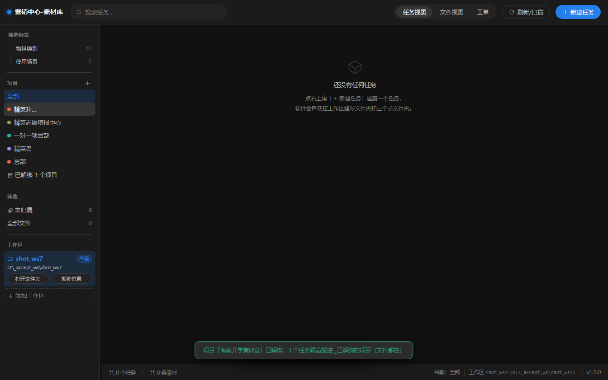

> 🟨 项目名建议用**公司/部门的正式叫法**。工单同步时靠"项目名对得上"来自动建任务，两边名字不一致任务就不会自动建（见第 4.3 节）。

#### 第 3 步：整理标签（可选）

左栏「筛选标签」下有两套维度：

| 维度   | 默认条数 | 用途                                                                     |
| ---- | ---- | ---------------------------------------------------------------------- |
| 物料类别 | 11   | 横幅 / 折页 / 单页 / 册子 / 展架 / 书籍 / 海报 / 电商长图 / KV-电子展示 / KV-喷绘印刷 / 节日海报-朋友圈 |
| 使用场景 | 7    | 线下讲座 / 对外派发 / 咨询展示 / 赠送 / 朋友圈 / 社群 / 新媒体（直播、短视频）                       |

点维度后面的 **「管理」** 可以加、改名、改颜色、删除。

> 🟨 **「物料类别」这一套清单是全软件唯一的**：你在标签管理里加一个"易拉宝"，新建任务时的类别选项里立刻就有；删掉"PPT"，它也不再出现。删类别时如果有任务正在用，会提示"目前有 N 个任务正在使用这个类别"，确认后这些任务归为「未分类」。

#### 第 4 步：建第一个任务

点右上角 **「＋ 新建任务」**：

📷 *新建任务弹窗——填名称、选项目、点选物料类别*

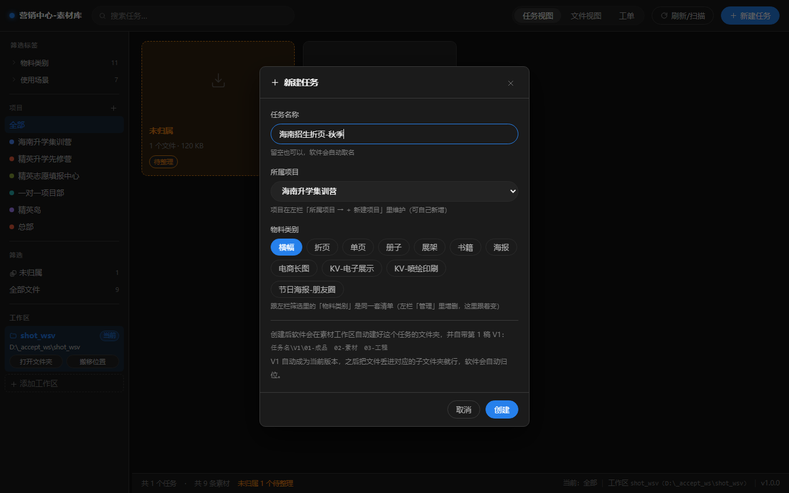

| 字段   | 怎么填               | 说明                       |
| ---- | ----------------- | ------------------------ |
| 任务名称 | 例：`海南招生海报-2026秋季` | 留空也行，软件自动取名 `未命名任务-日期时间` |
| 所属项目 | 下拉选               | 决定任务文件夹落在哪个项目文件夹下        |
| 物料类别 | 点选一个（chips）       | 清单与左栏「物料类别」同源            |

点「创建」后，磁盘上会**立刻**长出：

```
项目名\任务名\V1\01-成品　02-素材　03-工程
```

> 🟨 **名字里的非法符号会被自动替换**：`<>:"/\|?*` 会变成 `_`；开头的 `.` 或 `_` 会变成 `-`（下划线开头是软件的保留前缀）；结尾的点和空格会被去掉；重名会自动加 `-2`。所以不用担心起名起错，但起完可以去资源管理器核对一眼。

#### 第 5 步：把文件放进去，再"刷新扫描"

🟦 **这是最核心的一条操作习惯**：

> **软件不会主动盯着你的硬盘找新文件。你把文件放进任务文件夹后，必须回软件点一次右上角的「刷新/扫描」。**

正确做法：

1. 打开资源管理器，进到 `D:\vellum_workspace\项目名\任务名\V1\`；
2. 把文件放进对应子文件夹：
   - 最终交付的 → `01-成品`
   - 用到的原始素材 → `02-素材`
   - PSD / AI 源文件 → `03-工程`
3. 回软件，点顶栏 **「刷新/扫描」**（按钮上会显示百分比进度，例如 `生成缩略图 12/40 · 43%`）；
4. 完事会弹一条提示：`扫描完成：N 个任务 · M 个文件 · 新增 K 条 · 生成 T 张缩略图`。

也可以**直接在软件里认领**：把文件先丢到工作区任意位置 → 刷新扫描 → 到「文件视图」勾选它们 → 用顶部「认领条」搬进目标任务和子文件夹（见第 3.6 节）。

---

### B 段：工单与报表（第 6~8 步，按需）

> B 段这三步全在**顶栏第一格「工单队列」**里完成（软件启动就停在这一格，见 3.7）。
> 做完之后你才能：从企微拉单 → 自动建任务 → 在软件里指派 → 月底导出报表。
>
> **共同前置**：管理员已经建好了那两张**企微智能表格**，并且**给你开了访问权限**（你在企微里能打开它们）。

#### 第 6 步：扫码授权企业微信（一次就够）

**为什么**：工单队列的数据来自企业微信「智能表格」。软件要**以你的身份**去读它——这一步就是把这台电脑绑到你本人。没做这一步，工单队列是空的（界面会直接弹出授权引导）。

🟦 **要装什么：什么都不用装。** 需要的企微组件（**wecom-cli**）已经打进安装包了，你只差"扫一次码"。

**从哪进**：

- **首次启动时会自动弹一次**（只在"组件在、但还没授权"时弹）；
- 平时随时可从 **工单队列 → ⚙ 齿轮 → 最上面「企业微信连接」那一行的「打开连接引导」** 进来。

📷 *企业微信连接引导——状态徽标 + 组件来源/版本 + 说明 + 扫码区 + 按钮*

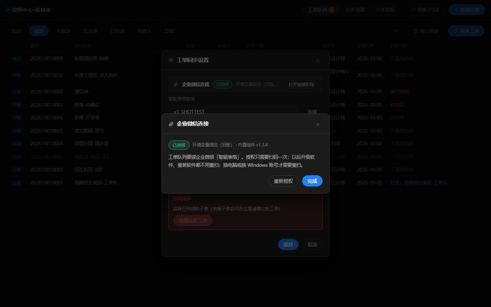

**怎么做**：

1. 先看第一行的状态徽标（见下表）；
2. 点 **「开始扫码授权」** → 窗口里出现一张二维码；
3. **用手机企业微信扫它** → 手机上点「确认」；
4. 窗口会自动变成「已授权」，并显示**你的名字**——这就是"连上了"最直接的证据。

> 扫码不方便？二维码旁边还给了一条**授权链接**，复制到手机上打开，同样能完成授权。

| 状态        | 含义             | 你要做什么            |
| --------- | -------------- | ---------------- |
| **已授权**   | 一切就绪           | 什么都不用做           |
| **未授权**   | 组件在，但没绑过企业微信   | 点「开始扫码授权」→ 手机企业微信扫码 |
| **内置组件缺失** | 安装包不完整         | 换最新安装包重装一次（其他功能不受影响） |
| **状态未知**  | 组件在但问不出状态（少见）  | 点「重新检查」；还不行就重装   |

🟨 三条要知道的：

1. **授权只需一次**：以后升级软件、重装软件都不用重扫（凭据存在 Windows 用户目录里，不在软件安装目录，软件自己也不存）；
2. **换电脑、或换 Windows 登录账号**，要重新扫一次；
3. 授权是**你本人**扫的——软件靠它判断"哪些单算我的"。

🟥 **不要点「重新授权」**，除非确实换了人或授权过期：它会让旧凭据作废，得从头再扫。

#### 第 7 步：配置工单表（把软件指到企微表格）

**为什么**：软件不知道去哪读单，得把「工单队列」这张**企微智能表格**的链接告诉它，并指定要同步哪几个子表。

**前置条件**（缺一样配不通）：

| 条件            | 说明                                    |
| ------------- | ------------------------------------- |
| 一张企微智能表格      | 里面至少有两个子表（印刷一张、电子一张）；表由管理员维护          |
| 表里有「设计师」成员列   | 用来判断"这单算谁的"，也是指派要写回的列                  |
| 你有权限          | 你在企微里能打开这张表；要**指派 / 写回**，还需要可编辑权限      |
| 第 6 步已授权      | 未授权时点「连接」会直接失败并弹出授权引导                 |

**怎么做（两步走）**：

1. 工单队列 → **⚙ 齿轮** → 打开「工单同步设置」；
2. 把智能表格链接**整条粘进「智能表格链接」**（形如 `https://doc.weixin.qq.com/smartsheet/…`）→ 点 **「连接」**。
   软件会去列子表、读你的身份——**通了下面才会列出子表**；
3. 勾选要同步的子表，并给每个子表标类型（**印刷 / 电子**）→ 点 **「保存」**。

📷 *工单同步设置——顶部「企业微信连接」状态行、表格链接、启用子表（勾选 + 印刷/电子类型）、本机使用者、允许指派开关、危险操作区*

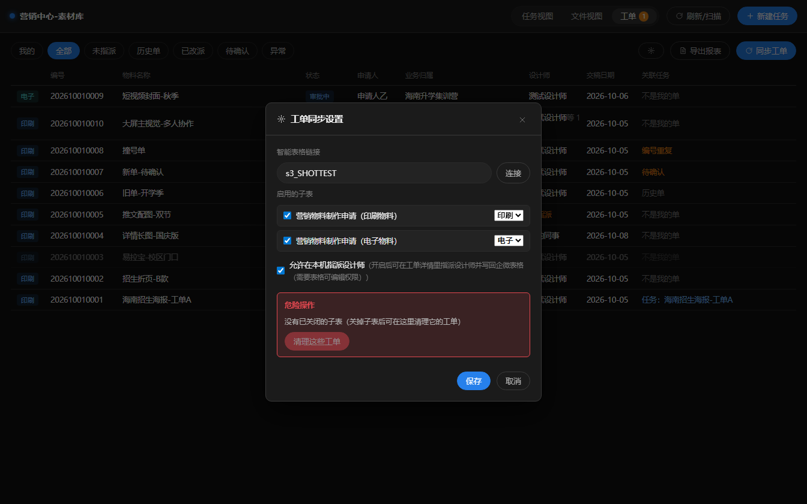

**保存后你会看到**：

| 元素                   | 说明                                          |
| -------------------- | ------------------------------------------- |
| 已识别表格                | 连接成功后显示表格名                                  |
| **本机使用者**            | 读自第 6 步的授权（换人要重新扫码）。它决定"哪些单算我的"             |
| 启用的子表                | **不勾的子表不会被同步**（但已同步进来的工单不会自动消失，见第 5 部分第 6 条） |
| **允许在本机指派设计师**       | **组长 / 管理员**才需要打开（需要表格可编辑权限）。改动立即生效，不用点保存    |

🟨 **首次同步的后果，设置里会明说**：「首次同步会把当前表里所有工单标记为历史单，不建任何任务」。也就是说——第一次点「同步工单」**不会**突然给你长出几百个任务文件夹，这是刻意的。之后新出现、且"设计师"列里有你的单，才会自动建任务。

配好后回工单队列，点 **「同步工单」** 拉第一次数据（第一次全是「历史单」，属正常）。

🟨 **配好了但单不进来？** 最常见两种：① 勾的子表标题和表里对不上；② 链接粘错（不是这张表）。
更细的失败排查、以及"为什么有的单自动建任务、有的不建"，见第 4.3 节。

#### 第 8 步：配置报表表（月底导报表才需要）

**为什么**：导出报表不是导一份本地文件，而是把数据写进**另一张**企微智能表格（叫「工单报表」）。所以这张表的链接也要告诉软件一次。

**前置**：「工单报表」这张智能表格里，要有一个子表叫 **「报表模板」**，并且下面这 12 列的**列名和类型完全一致**（表由管理员建好）：

| #  | 列            | 类型            |
| -- | ------------ | ------------- |
| 1  | 工单类型（印刷/电子）  | 单选（印刷 / 电子）   |
| 2  | 编号           | 文本            |
| 3  | 完成时间         | 日期            |
| 4  | 物料名称         | 文本            |
| 5  | 业务归属         | 文本            |
| 6  | 申请人          | 成员（多选）        |
| 7  | 设计师          | 成员（多选）        |
| 8  | 缩略图          | **图片**        |
| 9  | 印刷数量         | 数字（整数）        |
| 10 | 印刷金额         | 货币（¥）         |
| 11 | 绩效金额         | 货币（¥）         |
| 12 | 备注           | 文本            |

**怎么做**：

1. 工单队列 → 顶栏 **「导出报表」**；
2. 把「工单报表」的链接粘进 **「报表表格链接」**——**填过一次就记住了**，以后打开会自动预填；
3. 选开始 / 结束日期（默认当月 1 日 ~ 月末）→ 点 **「导出」**。

📷 *导出报表弹窗——报表表格链接 + 起止日期（默认当月）*

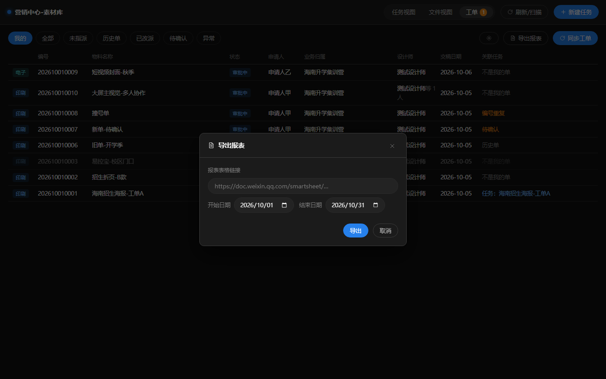

结果：在「工单报表」里**新建一个子表**（名字就是起止日期，如 `2026-10-01~2026-10-31`），复制「报表模板」的字段结构，写入该时间段内**完成时间**落在区间里的工单（12 列，逐列来源见 3.7 节 ⑥）。

🟨 **报表里没数据？** 多半是这段时间内没有"完成时间"落进来的单——还在审批中的单这一列是空的，天然不进报表（见第 4.3 节末尾与 FAQ Q8）。

> **导出前顺手做的一件事**：工单详情里的「印刷金额 / 绩效金额 / 备注」是**只存软件本地**的三个字段（企微表里没有这几列）。想让报表带上它们，就在这里按单填好（见 3.7 节 ⑤）。

#### B 段做完，自检一遍

| 检查    | 应该看到                              |
| ----- | --------------------------------- |
| 扫码授权  | 工单设置最上面显示 **「已授权」** + 你的名字        |
| 表格配置  | 点「同步工单」后列表出现工单（第一次全是「历史单」，且不建任务）  |
| 报表配置  | 重新打开「导出报表」，链接已预填（填过一次之后）          |

三项都对，第一次配置就完成了。以后**只有换电脑或换人**，才需要重做第 6 步。

---

## 1.5 备份 / 换电脑 / 卸载

### 备份 = 复制一个文件夹

**整个工作区文件夹拷走，就是完整备份**（素材 + 数据库 + 标签 + 工单记录全在里面）。

| 想做什么     | 怎么做                                                                                                                  |
| -------- | -------------------------------------------------------------------------------------------------------------------- |
| 日常备份     | 定期把 `D:\vellum_workspace` 复制一份到移动硬盘/另一台机器（用资源管理器复制粘贴即可）                                                                         |
| 换电脑      | ① 在新电脑装好软件；② 把工作区文件夹拷到新电脑（盘符路径尽量保持一致）；③ 打开软件 → 左栏「＋ 添加工作区」→ 选那个文件夹 → 软件会自动把库里的路径改成新位置（**改前自动备份到 `_system\backup\`**） |
| 换盘       | 同盘内搬家：左栏「搬移位置」；跨盘：资源管理器复制整个文件夹 → 「＋ 添加工作区」指过去 → 确认无误后再删原位置                                                           |
| 一个软件管多个库 | 左栏「＋ 添加工作区」可以加多个（比如"2026 年素材"和"历史素材"两个库），点一下即可切换                                                                     |

### 卸载

控制面板 → 程序和功能 → 卸载 **「Vellum工作台」**。

> 🟨 **卸载不会删你的素材**。工作区文件夹、你的设计文件、数据库都留在原处。想彻底清干净，卸载后再手动删 `D:\vellum_workspace`（🟥 删之前务必确认已经备份）。

---

# 第 2 部分：理解它，工单任务素材是什么关系

## 2.1 一句话讲清

> **工单**是别人（申请人）在企微上提的"我要一份什么物料"的申请；  
> **任务**是设计师接手后、在软件里建的那一个活儿（磁盘上是"一个文件夹"）；  
> **素材**就是这个文件夹里的**一个个文件**。
>
> 一张工单 → 一般对应 **1 个任务**；一个任务里装着 **N 个素材文件**。

## 2.2 四层结构图

```
组织层（软件里"看得见的管理单位"）
┌─────────────────────────────────────────────────────────┐
│  项目（如"海南升学集训营"）                                │
│   └── 任务（如"海南招生海报-2026秋季"）  ← 日常干活的最小单位 │
│        ├── V1（第 1 稿）                                  │
│        │    ├── 01-成品  →  海报_终稿.png                 │
│        │    ├── 02-素材  →  底图.jpg、字体.ttf            │
│        │    └── 03-工程  →  海报.psd                      │
│        └── V2（第 2 稿，改稿后新建）                       │
│             └── 01-成品  →  海报_终稿V2.png               │
└─────────────────────────────────────────────────────────┘

来源层（外部系统）
┌───────────────────────────────────────────────────────--──┐
│  企微智能表格「工单队列」  ←─同步─→  软件里的工单         │
│      · 审批通过 + 指派给本机 →  自动建任务（文件夹一起长好） │
│      · 完成任务 →  缩略图写回表格                          │
│  企微智能表格「工单报表」  ←─导出─  按起止日期新建子表       │
└─────────────────────────────────────────────────────────┘
```

## 2.3 三者对照表

| 对比项    | 素材（文件）           | 任务（包）                        | 工单                         |
| ------ | ---------------- | ---------------------------- | -------------------------- |
| 在软件哪里看 | **文件视图**         | **任务视图**                     | **工单队列**（顶栏第一格）            |
| 磁盘上是什么 | 一个真实文件           | 一个文件夹（含 V1/V2 子文件夹）          | **磁盘上不存在**，只活在企微表格 + 本地数据库 |
| 从哪来    | 你放进文件夹 / 认领进来    | 你手动新建，或工单同步自动建               | 企微审批同步下来                   |
| 数量关系   | N 个文件 ∈ 1 个任务    | N 个任务 ∈ 1 个项目；1 个任务可关联 1 张工单 | 1 张工单 → 通常 1 个任务           |
| 能被打标签吗 | ✅ 能（物料类别 / 使用场景） | ✅ 能（类别 / 项目）                 | ✖ 不能（字段来自表格）               |
| 有版本概念吗 | 有（属于哪一稿）         | 有（V1/V2/V3…）                 | 无                          |
| 删掉会怎样  | 记录标「文件已丢失」，可重新定位 | 擦记录会被扫描自动清理（磁盘文件夹已不在）        | 表格里删行 → 软件标「已不在表中」留底       |

## 2.4 三条"铁律"（理解了这三条，就不会踩坑）

### 铁律一：本地磁盘是唯一真相，软件只是"镜子"

软件不"拥有"文件——文件在资源管理器里。你在资源管理器里把文件删了/挪了，软件**下次扫描时会如实反映**（标"文件已丢失"或清理记录）。

**好处**：软件崩了、换电脑、重装，你的文件都在。  
**代价**：绕过软件去动文件夹，会带来第 5 部分那些麻烦。

### 铁律二：中间那层"任务"是文件夹，不是数据库里的虚拟对象

任务 = 磁盘上的一个文件夹。所以：

- 改任务名 → 文件夹跟着改名（里面文件一个不动）；
- 改所属项目 → 文件夹搬进另一个项目文件夹；
- 磁盘上任务文件夹没了 → 刷新扫描后任务记录自动摘除（留痕在 `_system\backup\`）。

### 铁律三：工单只负责"起头"和"回写"，不负责搬文件

工单同步**只会自动建一个空的任务文件夹**（`任务名\V1\01-成品…`），不会替你把文件放进去；设计师干的活（放文件、改稿、打包）都在任务这边。做完后点「完成任务」，把成品缩略图写回工单队列。

## 2.5 典型一天的用法

### 场景 A：设计师（主要使用者）

```
① 打开软件（**默认就停在「工单队列」**）→ 看「我的」列表（第一次会先让你扫码连一次企业微信，见 1.4 第 6 步）
② 发现新单没任务 → 点「同步工单」→ 软件自动建好任务文件夹
③ 点开这条工单 → 看尺寸/数量/交期/参考附件（「打开审批（含附件）」）
④ 去资源管理器（或软件里）把源文件放进任务对应的子文件夹
⑤ 回软件「刷新/扫描」→ 干完活，成品丢进 01-成品
⑥ 改稿 → 任务详情里「新建版本」→ 建 V2 → 丢新稿进去
⑦ 交付 → 「打包交付」生成 zip → 发给申请人
⑧ 收工 → 「完成任务」→ 缩略图自动写回工单队列（供绩效/报表用）
```

### 场景 B：组长/管理员

```
① 左栏维护项目（新业务立项 / 结项解绑）
② 检查「文件已丢失」入口（是不是有人动了磁盘）
③ 任务视图看各任务的版本与交付状态
④ 工单队列看「未指派」→ 分派给设计师（详情弹窗里指派，自动通知本人）
⑤ 月底 → 工单队列「导出报表」→ 按起止日期导出到「工单报表」
```

### 场景 C：只是想找素材

```
① 文件视图 → 搜索框输关键词
② 左栏点标签缩小范围（数字就是结果条数）
③ 「只看当前稿」勾上，排除历史稿干扰
④ 找到后双击文件名直接用系统默认程序打开；右键"打开所在文件夹"
```

---

# 第 3 部分：用它，界面逐块讲

## 3.1 界面总览

📷 *主界面（图示为任务视图；**软件启动时默认落在「工单队列」那一格**，见 3.7）——顶栏 / 左栏 / 主区 / 状态栏四块*

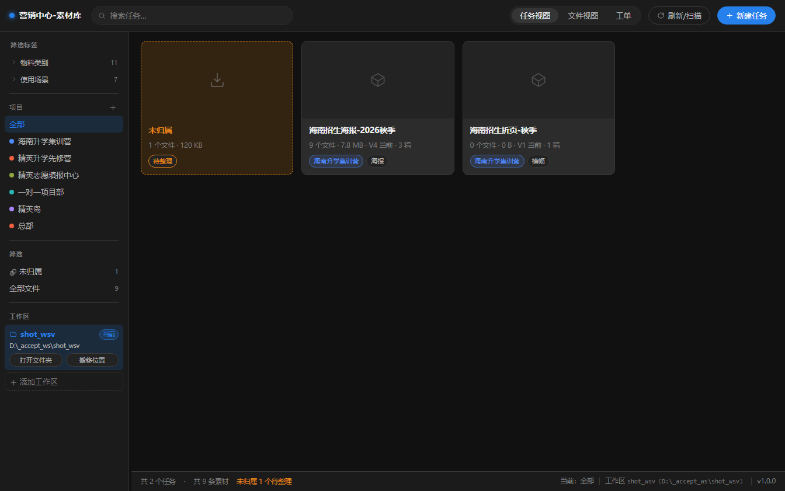

整个软件就四块：

| 编号 | 区域      | 一句话职责                   |
| -- | ------- | ----------------------- |
| ①  | **顶栏**  | 搜索、切视图、刷新扫描、新建任务        |
| ②  | **左栏**  | 标签筛选、项目、快速筛选入口、工作区管理    |
| ③  | **主区**  | 任务卡片 / 文件列表 / 工单列表（三选一） |
| ④  | **状态栏** | 数量统计、当前项目、当前工作区路径、软件版本号 |

## 3.2 顶栏

| 控件         | 作用                     | 限制 / 注意                               |
| ---------- | ---------------------- | ------------------------------------- |
| 🔍 搜索框     | 任务视图下搜任务名；文件视图下搜文件名    | 工单队列下**不显示**搜索框；输入即搜（防抖 0.22 秒）       |
| **工单队列**   | 显示企微工单列表（**顶栏第一格**、**启动默认打开这格**，第 22 批起） | 有未指派单时按钮上挂一个数字角标（悬停显示"待指派 N"）         |
| **任务视图**   | 显示任务卡片           | —                                     |
| **文件视图**   | 显示文件列表                 | —                                     |
| **刷新/扫描**  | 重新扫描工作区磁盘 → 更新记录、生成缩略图 | 扫描期间按钮变灰并显示百分比（如 `生成缩略图 12/40 · 43%`） |
| **＋ 新建任务** | 建一个新任务（文件夹当场长好）        | 需要工作区可用；项目至少有一个                       |

> 🟨 什么时候必须点「刷新/扫描」：**任何在软件外部改动了文件/文件夹之后**（新增、改名、移动、删除）。软件不会自动感知。

## 3.3 左栏

### ① 筛选标签

| 元素               | 说明                                         |
| ---------------- | ------------------------------------------ |
| 维度名（物料类别 / 使用场景） | 点一下展开该维度下的标签                               |
| 标签 + 数字          | 数字 = **当前项目范围内**贴了该标签的素材数（点开后列出的条数永远与数字一致） |
| 「管理」             | 打开标签管理弹窗：加标签、改名、改颜色、删除                     |
| 「清除 N」           | 一键清掉全部已选标签                                 |

**点标签会发生什么**：自动切到文件视图，只显示同时命中**全部已选标签**的文件。

### ② 项目

| 元素               | 说明                                |
| ---------------- | --------------------------------- |
| **全部**           | 不按项目过滤                            |
| 项目行（带颜色圆点）       | 点击 = 只看该项目的任务/文件                  |
| 行上悬浮图标           | ↑ ↓ ✎ 📤 🗑（见第 1.4 节表格）           |
| **待归类**          | 只在这些任务出现时显示——任务文件夹直接躺在工作区根目录，没选项目 |
| **📦 已解绑 N 个项目** | 只在有解绑项目时出现，点开可「还原」                |


*（示例）待归类任务归位：点任务卡片右上角 📥，在弹窗里选项目——文件夹会被搬进对应的项目文件夹，文件一个都不动*

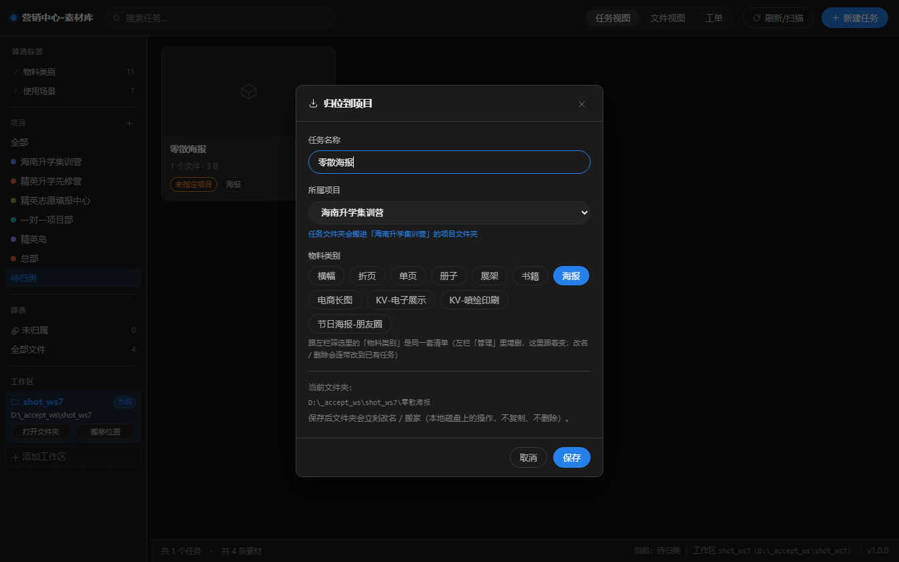

### ③ 筛选（快速入口）

| 入口               | 含义                                      |
| ---------------- | --------------------------------------- |
| **未归属** + 数字     | 文件没有归属任何任务（直接丢在工作区里的散文件）——需要"认领"进任务     |
| **⚠ 文件已丢失** + 数字 | 记录还在、但磁盘上的原文件找不到了（被删/被挪走）。**只有存在时才会出现** |
| **全部文件** + 数字    | 全库所有素材                                  |

> 🟨「未归属」（文件没进任务）和「待归类」（任务没选项目）是**两件不同的事**，别看混。

### ④ 工作区

| 元素          | 说明                            |
| ----------- | ----------------------------- |
| 工作区卡片       | 点一下切到另一个库（会整套重新加载，筛选状态清空）     |
| **当前** 标记   | 表示正在用这个库                      |
| **打开文件夹**   | 用资源管理器打开工作区根目录                |
| **搬移位置**    | 把整个工作区搬到别的路径（同盘瞬间完成；跨盘会弹窗指导）  |
| **✕**       | 从列表移除（**只去掉记录，磁盘文件一个字节不动**）   |
| **＋ 添加工作区** | 选一个文件夹作为工作区：空的就新建库，有素材库的直接接进来 |

### ⑤ 左栏宽度

左栏与主区之间有一条**竖向分隔条**：按住左右拖动可调宽度，**双击**恢复默认（220 px，范围 170–420 px）。

## 3.4 任务视图

📷 *任务卡片——封面、名称、文件数·容量、`V4 当前 · 3 稿` 版本徽标、项目/类别标签；左侧虚线卡片是「未归属」池*


### 任务卡片上有什么

| 位置      | 内容                          | 说明                         |
| ------- | --------------------------- | -------------------------- |
| 封面      | 任务里第一张有缩略图的文件               | 没有可预览文件时显示占位图标             |
| 名称      | 任务名                         | 悬停显示完整磁盘路径                 |
| 第二行     | `9 个文件 · 7.8 MB`            | **文件数与容量算的是全部版本**（历史稿也占硬盘） |
| 版本徽标    | `V4 当前 · 3 稿`               | 悬停说明"这个任务有 N 稿"            |
| 已交付     | `✓ 已交付`                     | 打包交付过就会出现                  |
| 标签      | 项目标签（带项目颜色）+ 类别标签           | 没有项目时显示橙色的「未指定项目」          |
| 右上角按钮   | ✎（编辑任务信息）/ 📥（归位到项目，仅待归类任务） | 鼠标悬停卡片才出现                  |
| 左上角红色角标 | `⚠ N`                       | 这个任务里有 N 个文件已丢失            |

### 未归属卡片

虚线框的「未归属」卡片不是任务，是**临时池**：装着"丢在工作区里、还没进任何任务"的文件。

**点它 = 跳到文件视图的「未归属」筛选**（跟左栏那个「未归属」按钮同一个去处）：勾选文件后会出现认领栏，选目标任务 + 子文件夹 → 点「认领」，文件就搬进去了。池子一空，这张卡片自己就消失。

### 空状态

一个任务都没有时，主区会显示引导文字：「点右上角「＋ 新建任务」建第一个任务，软件会自动在工作区建好文件夹和三个子文件夹。」

## 3.5 任务详情弹窗

📷 *任务详情——顶部信息与四个按钮、中间的版本条、下面四组文件*

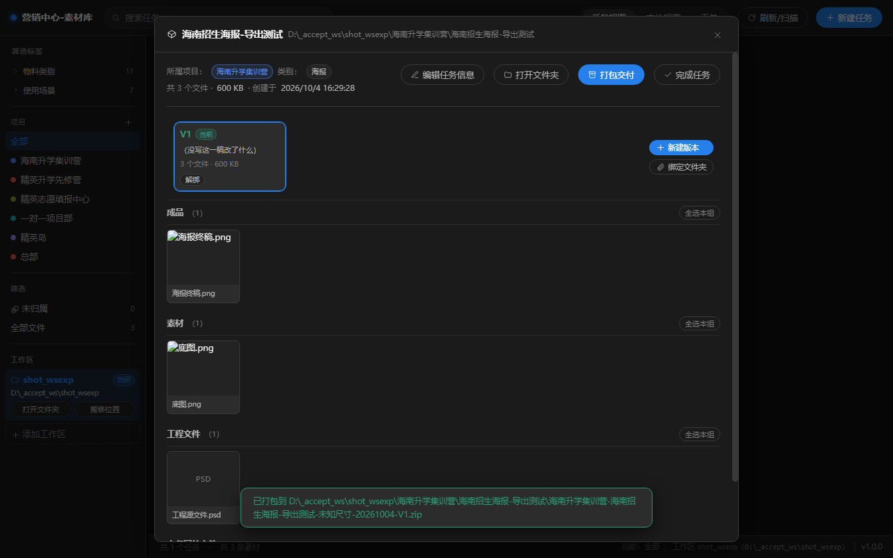

点任意任务卡片打开。从上到下：

### ① 顶部信息与按钮

| 元素                     | 作用                                        |
| ---------------------- | ----------------------------------------- |
| 所属项目 / 类别 / 文件数 / 创建时间 | 只读信息                                      |
| **✎ 编辑任务信息**           | 改名称、所属项目、类别（改名称=文件夹改名；改项目=文件夹搬家；只改类别不碰磁盘） |
| **📁 打开文件夹**           | 资源管理器打开任务文件夹                              |
| **📦 打包交付**            | 打 zip（见下）                                 |
| **✓ 完成任务**             | 生成成品缩略图并写回工单队列（见下）                        |

*（示例）编辑任务信息：改名称 → 文件夹跟着改名；改所属项目 → 文件夹搬家；只改类别 → 磁盘一个字节都不动*

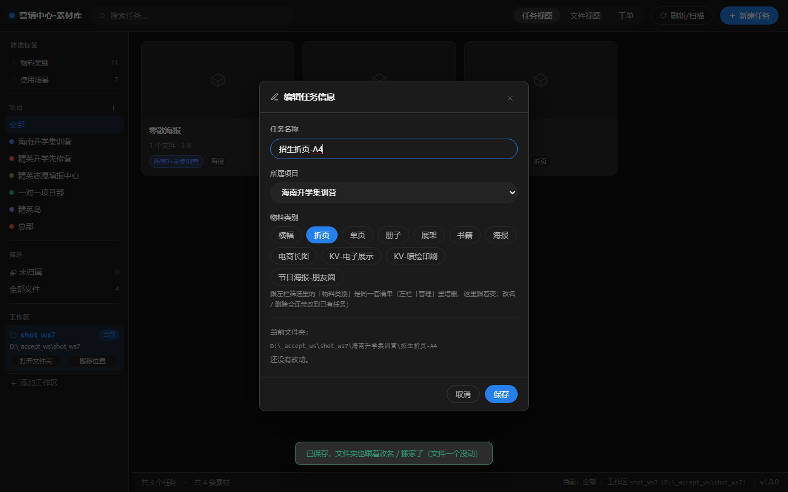

#### 「打包交付」弹窗

| 选项           | 说明                                                     |
| ------------ | ------------------------------------------------------ |
| 版本           | 当前版本 / 指定版本 / 全部版本（只列 V1、V2 这些）                        |
| 打包范围         | 成品 / 素材 / 工程文件 / 未归属的文件（**默认不勾"未归属的文件"**）              |
| 文件明细         | 逐个文件勾选，可单独剔除                                           |
| 保存到          | 默认是任务文件夹，可点「选择文件夹」改                                    |
| 压缩包名称        | **自动按规则生成**：`项目名-任务名-尺寸-打包日期-V几`，可手改                   |
| 尺寸           | 用于文件名，如 `1920x1080`；打开时会尝试从第一张成品图自动读取                  |
| 保留原文件名       | 不勾则内部文件名用序号代替                                          |
| 自定义文件名模板（可选） | 可用占位符：`{项目名} {任务名} {尺寸} {版本} {原文件名} {打包日期} {序号} {扩展名}` |
| 压缩包内加一层同名文件夹 | 默认勾选（解压后不会散成一堆文件）                                      |
| 底部摘要         | `预计 N 个文件 · 大小 · 输出到 路径`                               |

> 🟨 已丢失的文件**不会被打包**（列表里也不显示），这是刻意的安全行为。

#### 「完成任务」按钮

用途：把**最新版本里的全部成品图**（有几张传几张）生成缩略图，逐张上传写回工单队列的「缩略图」列——供绩效统计和导出报表使用。

| 结果      | 提示                      |
| ------- | ----------------------- |
| 成功      | `已完成：N 张成品缩略图已写回工单队列`        |
| 部分成功    | `已写回 N 张，另有 M 张未能上传（可稍后重试）` |
| 任务没关联工单 | `该任务未关联工单`              |
| 成品组里没有图 | `未找到成品图（请先在任务包里放一张成品图）` |
| 上传/写回失败 | 会说明具体原因；失败不会破坏任何数据，可重试  |

> 🟨 点这个按钮**不会改变工单审批状态**（状态由企微审批流决定）。
> 🟨 **第 27 批起支持多张**：一个任务包交付 2 张成品，就会写回 2 张缩略图（原来只写第一张）。

### ② 版本条

📷 *版本条——`V1 当前`、每稿一个格子，右侧是「＋ 新建版本」和「🔗 绑定文件夹」*

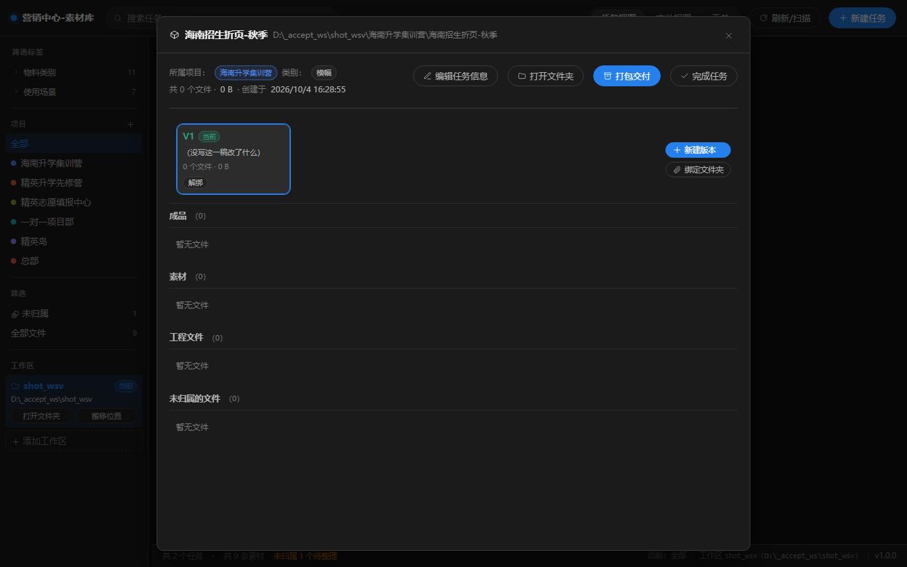

| 元素               | 作用                                                  |
| ---------------- | --------------------------------------------------- |
| `V1 / V2 / …` 格子 | 点一下切换"看哪一稿"，下面的文件列表跟着变                              |
| 「当前」徽标           | 这一稿是当前版本                                            |
| **＋ 新建版本**       | 建 `V<n>` 文件夹（里面自动长好三组空文件夹），可选"把现有文件收进第 1 稿"或"复制上一稿" |
| **🔗 绑定文件夹**     | 你自己在资源管理器建好了文件夹（如"终版-客户定稿"）？在这里绑定，**文件夹名和内容一个都不动**  |
| 格子里的 **设为当前**    | 回滚：只改指针，不删任何文件                                      |
| 格子里的 **解绑**      | 解除管理关系，磁盘上什么都不动                                     |
| **未分版本** 格子      | 装着没进 V1/V2 文件夹的文件（老任务常见）                            |

**新建版本的三个选项**（弹窗里）：

| 选项                   | 什么时候用                      |
| -------------------- | -------------------------- |
| 把任务里现在这 N 个文件收进第 1 稿 | 老任务（文件直接躺在包根的三组里）第一次纳入版本管理 |
| 把 V<n> 的文件复制一份进来     | 改稿省事，但**会多占一份硬盘空间**，默认不勾   |
| 版本说明                 | 建议填，例如"客户反馈——主标题太小，整体调亮"   |

### ③ 四个文件分组

| 分组         | 对应磁盘目录  | 放什么                                  |
| ---------- | ------- | ------------------------------------ |
| **成品**     | `01-成品` | 最终交付文件                               |
| **素材**     | `02-素材` | 用到的图片、字体等原始素材                        |
| **工程文件**   | `03-工程` | PSD / AI 等源文件                        |
| **未归属的文件** | 任务根目录   | 直接丢在任务文件夹下、没进三组的文件（黄字提示"可选中后移动进对应组"） |

操作：单击缩略图 = 用系统默认程序打开；右键 = 打开所在文件夹；勾选框 → 顶部出现"移动到 [下拉选组] → 确定移动"；每组右上角有 `全选本组 / 取消全选`。

## 3.6 文件视图

📷 *文件视图——工具栏（全选 / 只看当前稿 / 批量重新定位）+ 文件行（缩略图、文件名、标签、版本徽标）*

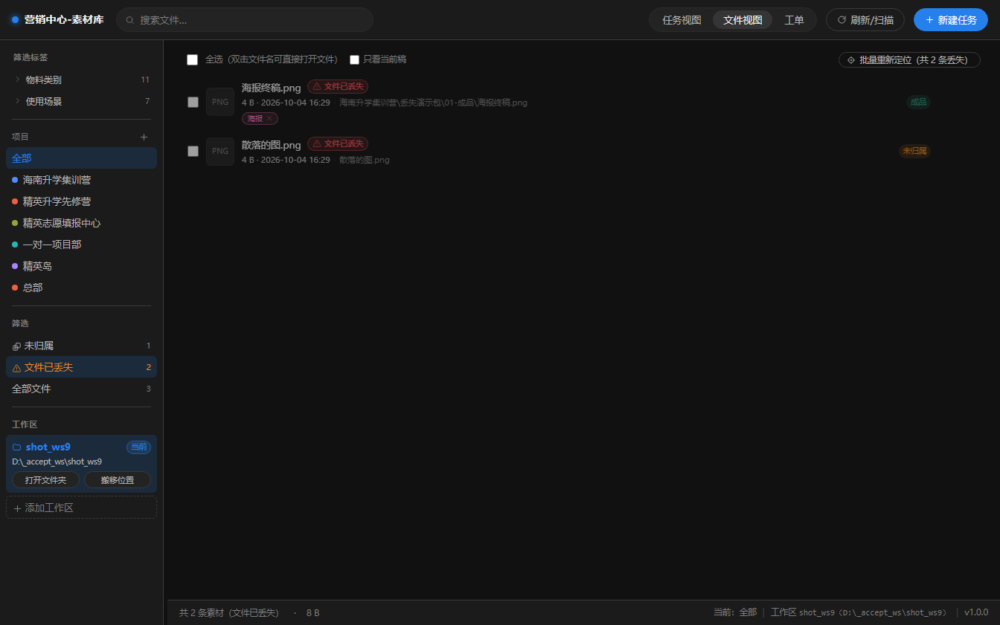

### 工具栏

| 控件         | 作用                                  |
| ---------- | ----------------------------------- |
| 全选         | 选中当前列表全部文件（双击文件名可直接打开文件）            |
| **只看当前稿**  | 只留各任务"当前版本"那一稿的文件（默认不勾，**不藏用户的东西**） |
| **批量重新定位** | 只在有文件丢失时出现；整批文件被挪走时用它找回             |

### 文件行

| 位置        | 内容                            |
| --------- | ----------------------------- |
| 勾选框       | 多选后可批量认领 / 打标签                |
| 缩略图       | 图片/视频/PSD/PDF 有图；其他类型显示扩展名    |
| 文件名       | 双击打开                          |
| 红色角标      | `⚠ 文件已丢失`——记录还在，原文件找不到了       |
| 大小 / 修改时间 | 只读                            |
| 相对路径      | 悬停看详情                         |
| 标签        | 已贴的标签色块，点小叉可摘掉                |
| 版本徽标      | `V3`（当前稿为绿色）                  |
| 行尾按钮      | 🔍 重新定位（仅丢失行）/ 打开文件 / 打开所在文件夹 |

### 认领条（选中文件后出现）

勾选任意文件后，列表上方出现一条操作栏：

```
已选中 3 个文件   [认领进] [— 选择任务 — ▾] [02-素材 ▾] [确定认领] [🏷 打标签] [取消]
```

「确定认领」= 把文件**真实搬进**目标任务的对应子文件夹（不是复制），并归属该任务。

### 「批量重新定位」弹窗

📷 *批量重新定位——选文件夹后软件按原目录结构试配，勾选后才落库*

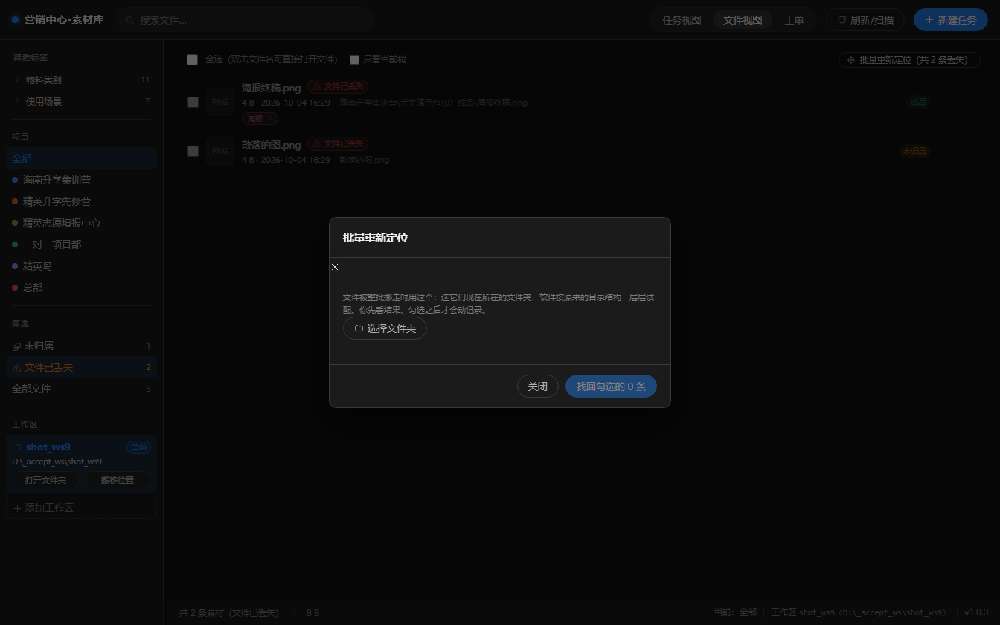

用法：文件被整批挪走（比如整个文件夹被搬到了别的盘）→ 点「选择文件夹」指向**它们现在所在的文件夹** → 软件按原目录结构逐层试配 → **你先看结果、勾选之后才会改记录**。

接受条件（很严格，防止找错文件）：**文件名 + 扩展名 + 大小三者全对**才算匹配。

### 打标签

选中文件 → 「🏷 打标签」→ 弹窗里：

- 顶部会显示"按文件名猜出 N 个可能的标签"（自动建议）；
- 同一维度里点多个 = 一次贴多个，但**同一维度内每张素材只保留最后选中的那个**；
- 注意提示：已选维度上的旧标签会被这批新标签**替换**掉。

## 3.7 工单队列（顶栏第一格）

**软件启动后默认就停在这一格**（第 22 批起）—— 日常第一件事就是看单，所以它既排最前、也是开机第一眼。

📷 *工单队列——7 个筛选、齿轮设置、导出报表、同步工单；列表有编号/物料名称/状态/申请人/业务归属/设计师/交稿日期/关联任务*

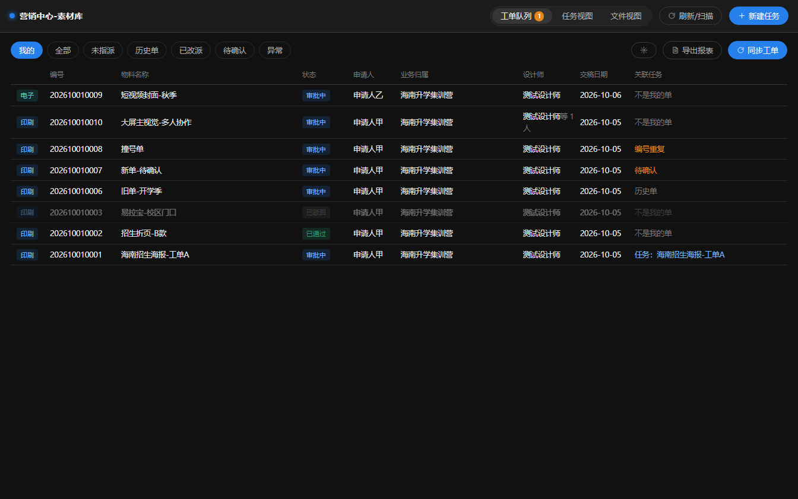

> 🟨 这个视图的所有数据来自**企微智能表格**。企微组件已随软件内置（不用自己装），
> 但**第一次要扫码授权一次**——没授权时界面会直接弹出授权引导（见下）。

### ⓪ 连接企业微信（第一次必做，之后一辈子不用管；配置流程见 1.4 第 6 步）

📷 *企业微信连接引导——状态徽标 + 组件来源/版本 + 说明 + 扫码区 + 按钮*


从哪进：**首次启动时自动弹一次**（只在"组件在、但还没授权"时弹）；之后随时可从
**工单队列 → ⚙ 齿轮 → 「企业微信连接」那一行的「打开连接引导」** 进来。

| 状态        | 含义             | 你要做什么            |
| --------- | -------------- | ---------------- |
| **已授权**   | 一切就绪           | 什么都不用做           |
| **未授权**   | 组件在，但没绑过企业微信   | 点「开始扫码授权」→ 手机企业微信扫码 |
| **内置组件缺失** | 安装包不完整         | 换最新安装包重装一次（其他功能不受影响） |
| **状态未知**  | 组件在但问不出状态（少见）  | 点「重新检查」；还不行就重装   |

扫码流程：点「开始扫码授权」→ 窗口里出现二维码 → **用手机企业微信扫** → 手机上点「确认」
→ 窗口自动变成「已授权」并显示本机使用者姓名。扫码不方便时，二维码旁边还给了一条**授权链接**（可复制到手机打开）。

> 🟨 三条要知道的：
> 1. **授权只需一次**：以后升级软件、重装软件都不用重扫（凭据存在 Windows 用户目录，不在软件安装目录里）；
> 2. **换电脑或换 Windows 登录账号**要重新扫一次；
> 3. 授权是**你本人**扫码——软件靠它判断"哪些单算我的"。
>
> 🟥 **不要点「重新授权」**，除非确实换了人或授权过期：它会让旧凭据作废，得重新扫。

### ① 筛选

| 筛选      | 含义                                 |
| ------- | ---------------------------------- |
| **我的**  | 设计师列里包含本机使用者（授权账号）的工单——**默认筛选**    |
| **全部**  | 表里所有单                              |
| **未指派** | 设计师列为空的单（顶栏角标数字就是这个口径）             |
| **历史单** | 首次同步时被标记为"历史"的单（不建任务）              |
| **已改派** | 原来是本机的单，后来被改派给别人（任务保留、只打标记）        |
| **待确认** | 子表重建后新出现的单（**放行后才会建任务**）           |
| **异常**  | ① 编号在表里出现两行（撞号）；② 业务归属填了但软件里没有同名项目 |

### ② 按钮

| 按钮         | 作用                               |
| ---------- | -------------------------------- |
| **⚙ 齿轮**   | 打开「工单同步设置」（见下）                   |
| **导出报表**   | 按起止日期导出到「工单报表」智能表格               |
| **同步工单**   | 从企微拉最新数据（按钮悬停会显示当前绑定的表格名）        |
| **确认这批新单** | 只在「待确认」筛选且有数据时出现——批量放行新单并按规则补建任务 |

### ③ 列表里的提示词（在「关联任务」列）

| 显示                           | 含义               | 怎么办              |
| ---------------------------- | ---------------- | ---------------- |
| `任务：xxx`                     | 已关联任务            | —                |
| `已改派给 xxx`                   | 任务还在本机，但设计师已换成别人 | 按需交接             |
| `还没建任务（同步时自动建；项目对不上会等对齐后补建）` | 本机负责、状态就绪，但还没建   | 点详情里的「建任务」可手动补   |
| `待确认`                        | 属子表重建后的新单        | 用「确认这批新单」放行      |
| `编号重复`                       | 表里有两行同编号         | 去表格修正，软件两份都保留    |
| `历史单`                        | 首次同步的存量单         | 不建任务；要干活就手动「建任务」 |
| `已不在表中`                      | 表格里这行已被删         | 软件留底，不删记录        |
| `不是我的单`                      | 本机不在设计师列里        | —                |
| `未指派`                        | 设计师列为空           | 去指派              |

### ④ 工单同步设置（齿轮）

📷 *工单同步设置——顶部「企业微信连接」状态行、表格链接、启用子表（勾选 + 印刷/电子类型）、本机使用者、允许指派开关、危险操作区*


**首次配置两步走**（完整流程见 1.4 第 7 步）：

1. 把企微智能表格链接粘进「智能表格链接」→ 点 **「连接」**（软件会列子表、读授权身份，通了才算过）；
2. 勾选要同步的子表，给每个子表标类型（**印刷 / 电子**）→ 点 **「保存」**。

| 元素                   | 说明                                          |
| -------------------- | ------------------------------------------- |
| **企业微信连接**（第 21 批新增，最上面一行） | 组件状态 + 来源 + 版本 + 「打开连接引导」按钮（授权入口常驻，不用等首次弹窗）   |
| 已识别表格                | 连接成功后显示表格名                                  |
| 启用的子表                | **不勾的子表不会被同步**（但已同步进来的工单不会自动消失，见第 5 部分）     |
| 本机使用者                | 读自企微授权（换人要重新扫码授权）。它决定"哪些单算我的"                |
| **允许在本机指派设计师**       | 打开后才能在工单详情里指派并写回企微表（需要表格可编辑权限）。改动立即生效，不用点保存 |
| 🟥 **危险操作 · 清理这些工单** | 清理**已关闭子表**残留的工单（详见第 5 部分第 6 条）             |

> 🟨 **首次同步的后果，弹窗里会明说**：「首次同步会把当前表里所有工单标记为历史单，不建任何任务」。也就是说——第一次同步不会突然给你长出几百个任务文件夹，是刻意的。

### ⑤ 工单详情弹窗

📷 *工单详情——顶部指派区（标签 + 下拉 + 提交指派），下面基本信息 / 印刷信息 / 关联任务 / 报表统计*

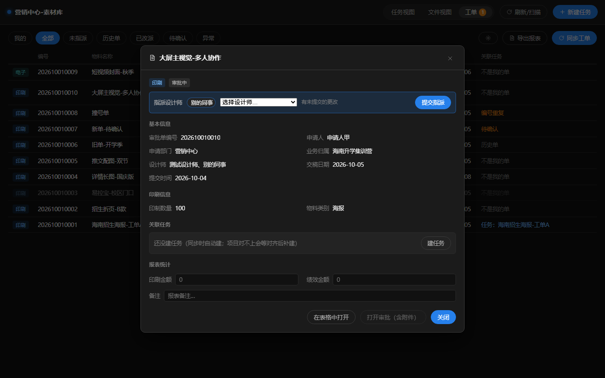

| 区块        | 内容                                                                 |
| --------- | ------------------------------------------------------------------ |
| **指派设计师** | 有权限时：下拉选人（选项带"在办 N 单"参考）→ 点选后变标签 → 点 **「提交指派」** 才真正写回企微表并给本人发通知    |
| 基本信息      | 审批单编号 / 申请人 / 申请部门 / 业务归属 / 设计师 / 交稿日期 / 提交时间 / 完成时间 / 物料申请用途 / 备注 |
| 印刷信息      | 只有印刷单有：尺寸 / 印制数量 / 物料形态 / 物料类别 / 收货人 / 收货电话 / 送达日期                 |
| 电子物料信息    | 只有电子单有：物料使用场景 / 物料类别                                               |
| 关联任务      | 已关联时显示任务名 + 文件数；未关联时给 **「建任务」** 按钮                                 |
| **报表统计**  | 三个**只存本地**的字段：印刷金额 / 绩效金额 / 备注（离开输入框即存，供导出报表用）                     |
| 底部按钮      | **在表格中打开**（逃生口）/ **打开审批（含附件）** / 关闭                                |

> 🟨 指派的三条限制：① 本机开关没开 → 显示"等待指派"；② **至少保留一位设计师**（API 无法把成员列清空，要清空请去表格里手动清）；③ 历史单 / 待确认单 / 已删行的单**不能指派**。

### ⑥ 导出报表

**首次配置**（把「工单报表」链接告诉软件）见第 1.4 节第 8 步；这里讲日常怎么用。

📷 *导出报表弹窗——报表表格链接 + 起止日期（默认当月）*


1. 粘贴「工单报表」智能表格链接（填过一次会记住）；
2. 选**开始日期 / 结束日期**（默认当月 1 日 ~ 月末）；
3. 点「导出」。

结果：在「工单报表」里**新建一个子表**（名字就是 `2026-10-01~2026-10-31`），复制「报表模板」的字段结构，写入该时间段内**完成时间**落在区间内的工单，共 12 列：

| #  | 列           | 来源                 |
| -- | ----------- | ------------------ |
| 1  | 工单类型（印刷/电子） | 工单                 |
| 2  | 编号          | 工单                 |
| 3  | 完成时间        | 工单（筛选依据）           |
| 4  | 物料名称        | 工单                 |
| 5  | 业务归属        | 工单                 |
| 6  | 申请人         | 工单                 |
| 7  | 设计师         | 工单（全量）             |
| 8  | 缩略图         | 完成任务时写回的图          |
| 9  | 印刷数量        | 工单                 |
| 10 | 印刷金额        | **本地字段**（软件里手填）    |
| 11 | 绩效金额        | **本地字段**（先空着，事后手填） |
| 12 | 备注          | **本地字段**           |

> 🟨 导出为空时提示 `该时间段没有已完成工单`——最常见的原因是选的日期区间里没有"完成时间"落在其中的单（见第 6 节 FAQ）。

## 3.8 全部弹窗与按钮速查表

| 弹窗        | 打开方式                 | 主要按钮                                                           |
| --------- | -------------------- | -------------------------------------------------------------- |
| 新建任务      | 顶栏「＋ 新建任务」           | 创建 / 取消                                                        |
| 编辑任务信息    | 任务卡片 ✎ 或任务详情「编辑任务信息」 | 保存 / 取消                                                        |
| 任务详情      | 点任务卡片                | 编辑任务信息 / 打开文件夹 / 打包交付 / 完成任务 / 新建版本 / 绑定文件夹 / 设为当前 / 解绑 / 确定移动 |
| 打包交付      | 任务详情「打包交付」           | 选择文件夹 / 开始打包 / 取消                                              |
| 新建版本      | 版本条「＋ 新建版本」          | 建 V<n> / 取消                                                    |
| 绑定文件夹     | 版本条「绑定文件夹」           | 绑成 V<n> / 取消                                                   |
| 新建 / 编辑项目 | 左栏项目区 ＋ 或行上 ✎        | 保存 / 取消                                                        |
| 删除项目      | 项目行上 🗑              | 转移到其他项目 / 变成待归类 / 删进回收站                                        |
| 已解绑的项目    | 左栏「📦 已解绑 N 个项目」     | 还原                                                             |
| 标签管理      | 左栏维度「管理」             | 添加 / 改名 / 改色 / 删除                                              |
| 打标签       | 认领条「🏷 打标签」          | 贴到 N 个文件 / 取消                                                  |
| 批量重新定位    | 文件视图工具栏（有丢失时）        | 选择文件夹 / 找回勾选的 N 条                                              |
| 企业微信连接（授权） | 首次启动自动弹 / 工单设置顶部「打开连接引导」 / 同步失败时自动弹 | 开始扫码授权 / 重新授权 / 取消授权 / 完成 / 稍后再说                        |
| 工单同步设置    | 工单队列 ⚙               | 连接 / 保存 / 清理这些工单（危险）                                           |
| 工单详情      | 点工单行                 | 提交指派 / 建任务 / 在表格中打开 / 打开审批（含附件） / 关闭                           |
| 导出报表      | 工单队列「导出报表」           | 导出 / 取消                                                        |

---

# 第 4 部分：边界，限制前置条件做不到的事

## 4.1 环境与硬件要求

| 项         | 要求 / 现状                                      |
| --------- | -------------------------------------------- |
| 操作系统      | Windows 10 / 11，64 位（暂无 macOS / Linux 版本）    |
| 安装包签名     | **未签名**，安装时会出现「已保护你的电脑」提示，需点「更多信息 → 仍要运行」    |
| 显卡        | 无要求（软件**主动关闭 GPU 硬件加速**，走软件渲染以保证老机器/办公机稳定启动） |
| 网络        | 素材管理**完全离线可用**。只有工单同步、指派写回、导出报表需要能访问企业微信     |
| 多显示器 / 缩放 | 未做专门适配，系统缩放 125%/150% 下可用                    |

## 4.2 功能限制清单

| #  | 限制                     | 具体表现                                                | 为什么要知道                             |
| -- | ---------------------- | --------------------------------------------------- | ---------------------------------- |
| 1  | **软件没有"删除"功能**         | 界面里找不到"删除素材/删除任务"按钮                                 | 想删文件请去资源管理器删；想删任务就删任务文件夹再刷新扫描      |
| 2  | 文件丢失 ≠ 记录消失            | 原文件被删/挪走 → 记录保留并标「文件已丢失」，可重新定位                      | 这是刻意设计（防止误删记录），但也意味着**丢失记录不会自动清掉** |
| 3  | 同一时刻只有一个"当前工作区"        | 多库可切换，但同时只用其中一个                                     | 切库会清空筛选状态                          |
| 4  | 跨盘搬移工作区要手工             | 软件只做同盘瞬时搬移，跨盘弹窗教你自己复制                               | 避免几百 GB 搬到一半断掉                     |
| 5  | 版本文件夹只认 `V<数字>`        | 手工建的 `V1/V2` 会自动纳入；"终版"这种要手工「绑定」                    | 编号被占用时会提示，不会硬塞                     |
| 6  | 「物料类别」清单全局唯一           | 建任务的类别选项 = 左栏标签里的物料类别                               | 删/改会影响已有任务的类别                      |
| 7  | 项目名不能以下划线或点开头          | 会被拒绝（与软件自己的目录冲突）                                    | —                                  |
| 8  | 任务名里的非法字符会被净化          | 见第 1.4 节                                            | 建完可去资源管理器核对                        |
| 9  | 缩略图规格                  | 宽 320 px；覆盖图片 / 视频 / PSD / PSB / PDF；**其他类型只显示扩展名** | 大图不会拖慢界面                           |
| 10 | 打包不包含丢失的文件             | 已丢失的文件不进 zip                                        | 安全行为                               |
| 11 | 关闭子表 ≠ 清空数据            | 见第 5 部分第 6 条                                        | 需要手动清理                             |
| 12 | 工单字段只读                 | 工单信息来自表格，软件里改不了（除本地三字段）                             | 改字段要去表格改                           |
| 13 | 指派至少留一人                | API 无法清空成员列                                         | 要清空须去表格手动清                         |
| 14 | 统计口径                   | 任务卡片/顶栏的"文件数、容量"算**全部版本**                           | 与"占硬盘多少"口径一致                       |
| 15 | 标签在同一维度内单选             | 每张素材在每个维度只能有一个标签                                    | 批量打标签时同维度旧标签会被替换                   |
| 16 | 文件必须放在"任务文件夹结构里"才会归属任务 | 丢在工作区任意位置的散文件只进「未归属」池                               | 需要手动"认领"进任务                        |

## 4.3 工单同步的前置条件与三类失败

### 前置条件（缺一样都会同步失败）

| 条件               | 说明                                             |
| ---------------- | ---------------------------------------------- |
| 企微组件可用           | **已随软件内置**（第 21 批起），不用自己装；用环境变量 `WECOM_CLI_EXE` 可临时指定别的版本 |
| 企业微信授权有效         | 授权过期会报"权限已过期"，需重新授权（界面会直接弹出授权引导）                |
| 本机使用者 = 企微授权的那个人 | 「我的」筛选、自动建任务都以这个人为准                            |
| 企业在表格上的权限        | 自动建任务要读表；指派/写回/导出要可编辑权限                        |
| 表格结构符合约定         | 需要「设计师」成员列（用于指派）；工单队列建议有「缩略图」image 列（用于完成任务写回） |
| 报表表结构符合约定        | 导出报表要一张「工单报表」智能表格，里面带「报表模板」子表（12 列，列名与类型见 1.4 第 8 步）    |

### 三类失败的界面提示（都不会白屏、不会静默）

| 提示                                       | 原因                 | 怎么办                     |
| ---------------------------------------- | ------------------ | ----------------------- |
| `企微同步暂不可用（内置组件缺失或未授权），其余功能不受影响`         | 安装包损坏 / 没授权        | 界面会**自动弹出授权引导**，扫码一次即可；组件缺失则重装；**素材管理功能不受影响** |
| `企微授权已过期，请在企业微信里重新授权后重试`                 | 授权失效               | 界面会**自动弹出授权引导**，重新扫一次就好 |
| `同步失败：<具体原因>`                            | 其他（表格删了、字段被改名、网络等） | 按提示排查；字段类问题去表格核对列名      |

### 自动建任务的规则（为什么有的单自动长出任务、有的没有）

一张单要自动建任务，必须**同时**满足：

1. 不是历史单（首次同步的存量单不建）
2. 不是待确认单（子表重建后的新单要先放行）
3. **本机使用者在该单的"设计师"列里**
4. 审批状态是"就绪"的状态（审批中/已通过这类）
5. **该单的"业务归属"能在软件里找到同名项目**

第 5 条最容易卡住：表格里写"海南升学集训营"，软件里项目叫"海南升学集训营（2026）"→ 名字对不上 → 不建任务（会进「异常」筛选并给警告）。**把项目名对齐，下一轮同步会自动补建。**


### 关于「完成时间」（导出报表最常见疑问）

- 「完成时间」= **审批流程走完那一刻**，由企微审批自动写入；
  - 已通过 → 写"已办理"时刻；已驳回 → 写"已驳回"时刻；
- **还在审批中的单，这一列是空的** → 天然不会进报表（报表按完成时间筛选）；
- 因此"我的单怎么导不出来"通常不是 bug，而是它还没走完审批。

---

# 第 5 部分：合法但不推荐，12 个"能干但别干"的动作

> 下面这些操作，软件**不会拦你**（有的拦不了），但只要做了，就会遇到"记录对不上/东西找不到"的麻烦。  
> 每条都写清「后果」和「正确做法」。

| #  | 动作                                    | 后果                                                                     | ✅ 正确做法                                                                                    |
| -- | ------------------------------------- | ---------------------------------------------------------------------- | ----------------------------------------------------------------------------------------- |
| 1  | 在资源管理器里**改任务文件夹的名字**                  | 刷新扫描后：旧任务的记录+标签+版本关联被清理（留痕在 `_system\backup\`），新名字的文件夹变成"游离的包"出现在「待归类」 | 用任务卡片 ✎ **「编辑任务信息」**&#x6539;名——软件会改名并保住全部关联                                               |
| 2  | 在资源管理器里**把任务文件夹挪到别处**                 | 同上：记录被清理/标丢失，标签、版本、工单关联全丢                                              | 用「编辑任务信息」改项目（软件搬文件夹）；换盘用工作区搬移                                                             |
| 3  | 把文件**直接丢在工作区根目录**                     | 会进「未归属」池，不属于任何任务/版本，统计口径混乱                                             | 丢进 `任务\V1\01-成品`（或对应组），再刷新扫描；或丢进去后**认领**                                                  |
| 4  | **手工改名 `V1`/`V2` 文件夹**（如改成"第一稿"）      | 这一稿在版本条上显示"文件夹不在"，文件可能掉进「未分版本」                                         | 保持 `V<n>` 命名；想用别的名字就**绑定文件夹**                                                             |
| 5  | 🟥 **删 `_system` 文件夹**（尤其 `media.db`） | **所有标签、版本记录、工单记录、本地字段（印刷金额等）全部丢失**；素材文件还在，但会变成待归类/未归属，需要重新整理           | 备份/搬移请整目录复制，别单独动 `_system`                                                                |
| 6  | **关掉子表后不做清理**                         | 关闭只停止"以后同步"，**已同步进来的工单会永久留在本地**（曾出现"只留一个测试子表，同步后仍 200+ 条"）             | 工单设置 → 危险操作区 → **「清理这些工单」**（会先预览条数、二次确认、删除前自动备份到 `_system\backup\`）。注意：**已建任务包的工单会被跳过不删** |
| 7  | 用**网盘/OneDrive 同步目录**当工作区             | 云端占位符、改名、并发写会让大批文件被判"文件已丢失"，甚至数据库损坏                                    | 工作区放在本机固定盘或移动硬盘，不要放在自动同步目录里                                                               |
| 8  | **两台电脑同时**打开同一个工作区（共享盘/网络位置）          | 数据库是单机独占的，并发写有损坏风险；两边的操作也会互相覆盖                                         | 一个库同一时间只在一台机器上用；跨机用"复制工作区 + 添加工作区"                                                        |
| 9  | 把「解绑项目」当"删除"用                         | 项目在软件里彻底隐身，容易误以为文件没了（其实在 `_已解绑的项目` 里）                                  | 结项留底用它；只是想清理视图也可以，但要知道东西还在，随时可「还原」                                                        |
| 10 | 删进回收站后**再去资源管理器删 `_回收站`**             | 这是**唯一**能真正彻底删除素材的路径，删了不可恢复（软件里没有"回收站还原"之外的手段）                         | 确认一个季度内都不需要了再删                                                                            |
| 11 | 在智能表格里**改列名 / 删列 / 删行**               | 删行 → 软件标"已不在表中"留底（不删记录）；改列名 → 对应字段读不进来，会出警告；删「设计师」列 → 指派不可用            | 改结构前先在软件里同步一次留存基线；改完再同步看警告                                                                |
| 12 | 软件正在**跑扫描/同步时**直接拔移动硬盘或强退             | 工作区变成"连不上"，需要「重试」；极端情况下会留下半成品临时文件                                      | 等操作结束；非正常退出后先「重试」，再「刷新/扫描」                                                                |

> 补充一条"合法但容易忘"的：**在软件里把某稿「解绑」之后，下次扫描不会又把它自动认回来**（软件记了忽略名单）。  
> 想收回，就在版本条上点「绑定」——所以解绑是安全的，不怕手抖。

---

# 第 6 部分：常见问题 FAQ

**Q1：双击图标没反应 / 一闪就没了？**  
① 先等 10 秒（首次启动要初始化工作区）；② 若弹出「启动/运行异常」黑框，把里面的内容截图发给管理员；③ 检查是不是杀毒软件拦了——把安装目录加进白名单。

**Q2：顶部出现黄条「工作区『xxx』连不上，里面的东西一件没动」？**  
说明工作区所在的盘没挂上/没权限。插好移动硬盘后点 **「重试」**；路径变了就点 **「更改位置」** 指到新位置。**软件绝不会偷偷换位置。**

**Q3：我把文件放进文件夹了，软件里怎么没有？**  
软件不会自动发现。回软件点 **「刷新/扫描」**。如果还是没有：① 确认文件放在 `任务文件夹\V几\01-成品|02-素材|03-工程` 里；② 检查左栏筛选是不是选了某个标签/项目把结果过滤掉了。

**Q4：文件行显示「⚠ 文件已丢失」怎么办？**  
说明记录还在、磁盘上的原文件找不到了。点行尾 **🔍 重新定位** 指到它现在的位置（校验：文件名 + 扩展名 + 大小全对才接受）；一批文件同时被挪走就用工具栏 **「批量重新定位」**。

**Q5：为什么工单同步提示"企微同步暂不可用"？**  
两种可能：① **没授权**（最常见）——界面会直接弹出授权引导，用手机企业微信扫一次就好；
② **内置组件缺失**（安装包不完整，少见）——换最新安装包重装一次。
两种情况都**不影响素材管理、任务、打包这些功能**，只是不能同步工单。

**Q5b：换了电脑 / 换了 Windows 登录账号，要做什么？**  
重新扫码授权一次（首次启动会自动弹引导）。授权凭据存在 Windows 用户目录里，
**换软件版本、重装软件都不用重扫**。

**Q6：同步了，但我的单没自动建任务？**  
按第 4.3 节的 5 个条件逐条看。最常见是 **"业务归属"和软件里的项目名不一致**——把两边名字改成一样，下轮同步会自动补建；也可以打开工单详情点「建任务」手动补。

**Q7：「异常」筛选里出现的单是什么意思？**  
① 编号在表里出现两行（撞号）→ 去表格修正；② 业务归属的项目在软件里不存在 → 对齐项目名。

**Q8：我的单没出现在导出报表里？**  
先看这张单的**完成时间**是不是空的——审批还没走完的单完成时间是空的，天然不进报表。再看选的起止日期区间有没有覆盖它。另外"已不在表中"的留底单也不进报表。

**Q9：点「完成任务」报错？**

- `该任务未关联工单` → 这个任务不是从工单建的，没有可回写的单；
- `未找到成品图` → 先往任务的 `01-成品` 放一张成品图（图片），刷新扫描后再点；
- 上传/写回失败 → 多为网络或权限问题，稍后重试；不影响任何已有数据。

**Q10：为什么"关闭子表"之后工单还在？**  
关闭子表只停止以后的同步，不会删历史数据。用「工单同步设置 → 危险操作 → 清理这些工单」（已建任务包的会跳过）。

**Q11：视频没有缩略图？**  
检查 `安装目录\resources\ffmpeg\` 下是否有 `ffmpeg.exe`（随包分发）。缺失时图片仍正常，只有视频功能降级。

**Q12：界面字太小 / 左栏太窄？**  
左栏宽度：拖分隔条，双击复位。界面整体缩放请用系统的显示缩放设置。

**Q13：软件里的数量统计和资源管理器里数出来的不一样？**  
正常。软件统计的是**登记在库里的记录**：`_thumbs`/`_system`/`_回收站` 等下划线开头目录一律不统计；"文件数、容量"算**全部版本**。

**Q14：能多人同时用吗？**  
每人一台电脑、各自一个工作区，各自独立使用。需要共享素材就把整个工作区文件夹复制给对方（或放到共享盘让对方"添加工作区"，但**不要两边同时打开写**）。

---

# 第 7 部分：附录

## 7.1 目录结构速查

| 路径                                    | 是什么                    | 能不能动                  |
| ------------------------------------- | ---------------------- | --------------------- |
| `<工作区>\<项目>\<任务>\V<n>\01-成品`          | 成品文件                   | ✅ 正常使用                |
| `…\02-素材`                             | 原始素材                   | ✅                     |
| `…\03-工程`                             | PSD/AI 等源文件            | ✅                     |
| `<工作区>\_thumbs`                       | 软件生成的缩略图               | 🟨 删了会自动重建（耗时）        |
| `<工作区>\_system\media.db`              | 数据库（标签/版本/工单记录）        | 🟥 **别删**             |
| `<工作区>\_system\backup`                | 自动留痕（清理包记录、清理工单、路径改写前） | 🟨 只读参考，别删            |
| `<工作区>\_回收站`                          | "删进回收站"的项目             | 🟨 里面才是真删             |
| `<工作区>\_已解绑的项目`                       | 结项留底                   | 🟨 用「还原」              |
| `%APPDATA%\proj_media\workspace.json` | 工作区列表配置                | 🟥 别动（删了软件就"忘了"工作区在哪） |

## 7.2 支持的素材格式

| 类别        | 扩展名                                                                    | 缩略图        | 额外读取信息     |
| --------- | ---------------------------------------------------------------------- | ---------- | ---------- |
| 图片        | jpg / jpeg / png / webp / gif / bmp / tiff / avif                      | ✅          | 宽高、色彩模式    |
| 视频        | mp4 / mov / mkv / avi / webm / m4v / mpg / mpeg / wmv / flv / ts / 3gp | ✅（抽帧）      | 时长、编码      |
| PSD / PSB | psd / psb                                                              | ✅（内嵌预览）    | 尺寸         |
| PDF       | pdf                                                                    | ✅（渲染第 1 页） | 页数         |
| 其他任意类型    | ai / zip / docx / ttf …                                                | ✖（显示扩展名）   | 仅文件名、大小、时间 |

> 任何类型都能被登记进库、认领进任务、参与版本与打包——只是没有缩略图。

## 7.3 术语表

| 词             | 在本软件里的意思                                 |
| ------------- | ---------------------------------------- |
| **工作区**       | 存放全部素材的根文件夹（如 `D:\vellum_workspace`）。整个文件夹拷走 = 完整备份 |
| **项目**        | 组织层第一级，磁盘上是一个文件夹（如"海南升学集训营"）             |
| **任务**        | 也叫"包"。一个活儿 = 一个文件夹。界面上就是任务卡片             |
| **素材 / 文件**   | 任务里的一个个真实文件                              |
| **稿 / 版本**    | 任务里的 `V1 / V2 / …` 子文件夹；"当前版本"是回滚指针      |
| **未归属**       | 文件没进任何任务（散在工作区里）                         |
| **待归类**       | 任务没选项目（文件夹躺在工作区根目录）                      |
| **文件已丢失**     | 记录还在，磁盘上的原文件找不到了                         |
| **认领**        | 把未归属的文件搬进目标任务                            |
| **工单**        | 企微智能表格里的一条审批记录（同步进软件）                    |
| **历史单 / 待确认** | 首次同步的存量单 / 子表重建后的新单——都不自动建任务             |
| **打包交付**      | 把任务里的文件按版本/分组打成 zip                      |
| **完成任务**      | 生成成品缩略图并写回工单队列                           |
| **留痕**        | 软件在 `_system\backup\` 里写的操作前快照           |

## 7.4 鼠标 / 键盘小技巧

| 操作               | 效果                   |
| ---------------- | -------------------- |
| 双击文件名            | 用系统默认程序打开文件          |
| 单击缩略图（任务详情）      | 打开文件                 |
| 右键缩略图（任务详情）/ 文件行 | 打开所在文件夹              |
| 拖左栏分隔条           | 调宽度；双击复位             |
| 悬停任务卡片           | 显示 ✎ / 📥 按钮         |
| 悬停项目行            | 显示 ↑ ↓ ✎ 📤 🗑 按钮    |
| 悬停按钮             | 大多数按钮有说明性提示（鼠标停 1 秒） |

## 7.5 版本与变更

| 项       | 值                                    |
| ------- | ------------------------------------ |
| 本手册对应软件 | **v1.8.1**（界面状态栏右下角可见；含第 1~22 批全部功能） |
| 手册版本    | 1.1（2026-10-04，补第 1.4 节 B 段：企微授权 / 工单表 / 报表表） |
| 手册维护    | 后续功能变更请同步更新本文件与 `docs/` 下对应方案文档      |

> 🟨 **给管理员的提醒**：界面状态栏的版本号取自 `package.json` 的 `version`。**出安装包前先确认它和本文件头部、`docs/` 最新方案文档写的一致**，否则安装包文件名会和界面里的版本号对不上。

---

*（本手册中提到的一切操作都以"本地磁盘是唯一真相"为前提。任何"不确定要不要删"的时候，先备份，再动手。）*
